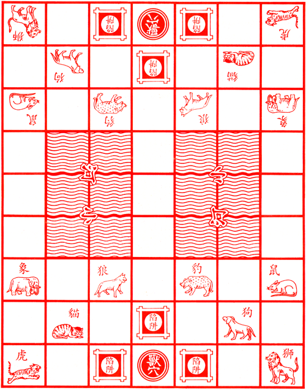
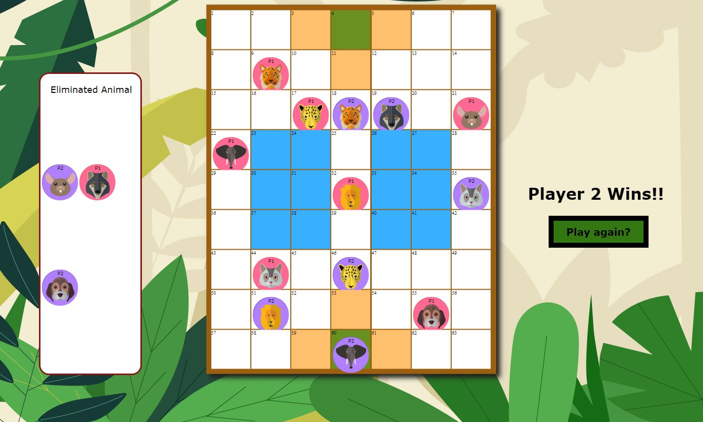
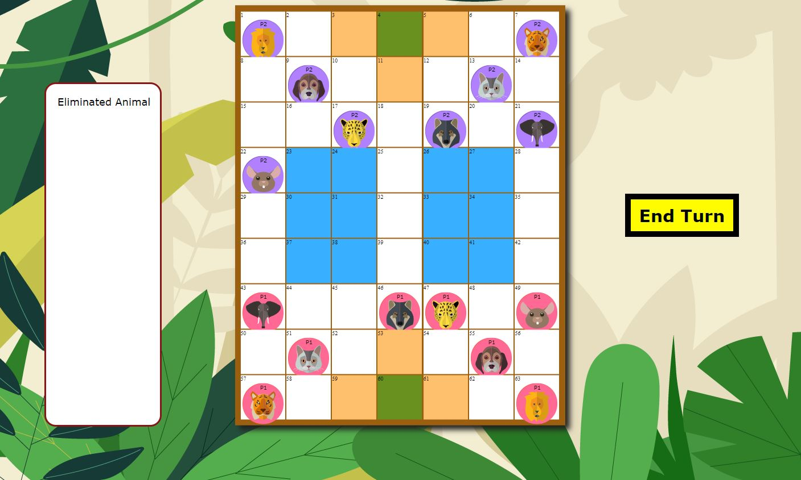
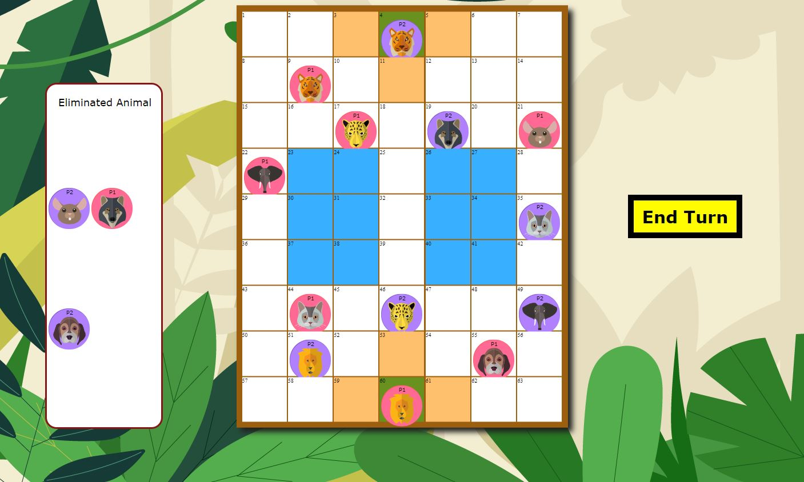

## Game Synopsis
Animal Chess (also known as Jungle King) is a Chinese board game that is mostly played among children.  

This strategy game is played between 2-players where they controlled 8 game pieces that represent different animals of various strength.

The players also used a 7 x 9 game-board (consists of 63 squares) with special element like “river”, “traps” and “beast den” to model a jungle-like-terrain. 

In my version of this game, the game-board do not use the special elements- "river" and "traps".

    

## Game Rules

<h3>How to win the game</h3>
To win the gameplay, one of the players must first manoeuvre any of the “animal” pieces into the opponent’s “beast den”.

Alternatively, the game can be won if the opponent’s animal pieces is left with 1.

    

<h3>How to move (animal piece)</h3>
  <ol>
    <li>The player who is assigned to start the gameplay is allowed to move any animal pieces that are <strong>RED</strong> in color (marked with "P1").
    All the animal pieces can move one square horizontally or vertically (not diagonally).
    <li>After the current player made the first move action, an "END TURN" button will appear on the right side of the game-board. 
    The current player will click to end his turn and pass the move action to the next player who controls the animal pieces 
    that are <strong>PURPLE</strong> in color (marked with "P2") .
  </ol>

    

<h3>What are the animals strength value</h3>
  <ul>
    <li> Elephant strength value - 8
    <li> Lion strength value - 7
    <li> Tiger strength value - 6
    <li> Leopard strength value - 5
    <li> Wolf strength value - 4
    <li> Dog strength value - 3
    <li> Cat strength value - 2
    <li> Rat strength value - 1
  </ul>    
<h3>How to capture opponent's animal pieces</h3>
Most animal pieces with higher strength value can capture opposing animals with lower strength value. 

For example, Wolf (Red color with strength value 4) is able to capture opposing Cat (Purple color with strength value 2).

On the side note, Rat is unique because of it's ability to capture opposing player's Elephant.
(Based on rumours - A rat can enter an elephant's big ear to kill it.)

    

## What is needed to play this game
  <ul>
    <li> Mouse and Keyboard
    <li> 1-2 players (Solo-Play is allowed)
  </ul>

## Getting Started
Click on the link to begin gameplay -
https://king-of-the-jungle.vercel.app/

## Technologies Used:
<ul>
  <li>HTML
  <li>CSS
  <li>Javascript
  <li>GitHub (with Vercel)
</ul>

## Creative Softwares Used
<ul>
  <li>Adobe Illustrator
  <li>Adobe Photoshop
</ul>

## Game Add-On (next version update)
<li> Add in the special elements ("River", "Traps") into the game board
<li> Lion and tiger has the ability to jump across the "River"
<li> Rat is the only animal that can enter "River"
<li> Any animal pieces that enters into the "Trap" will have '0' strength value 

## Wireframe of the game during planning stage
The wireframe was based on the initial idea. Some design layout was changed as the development of 
the game progresses but generally, the essence of the idea remains.

    

## Challenges during the making of this game
One of my challenges in the beginning was not able to write short lines of codes. 
Mostly were pretty long. After awhile, the whole bunch of codes became rather 
messy and in many occassion, I got confused and lost.

## Key Learning points
<ol>
  <li> I picked up the concept of constructor and implemented it into the game.
  <li> As there are many methods to build things, I was able to use arrays to create the game-board.
  <li> Take time to refractor or clean up the written codes ( e.g. "const name = () => {}" ) 
  <li> Build the logic or structure of the game before anything else.
</ol>

## Credit(s)
<li> artmonkey (https://www.freepik.com/author/artmonkey)
<li> Animal Chess (https://en.wikipedia.org/wiki/Jungle_(board_game))

